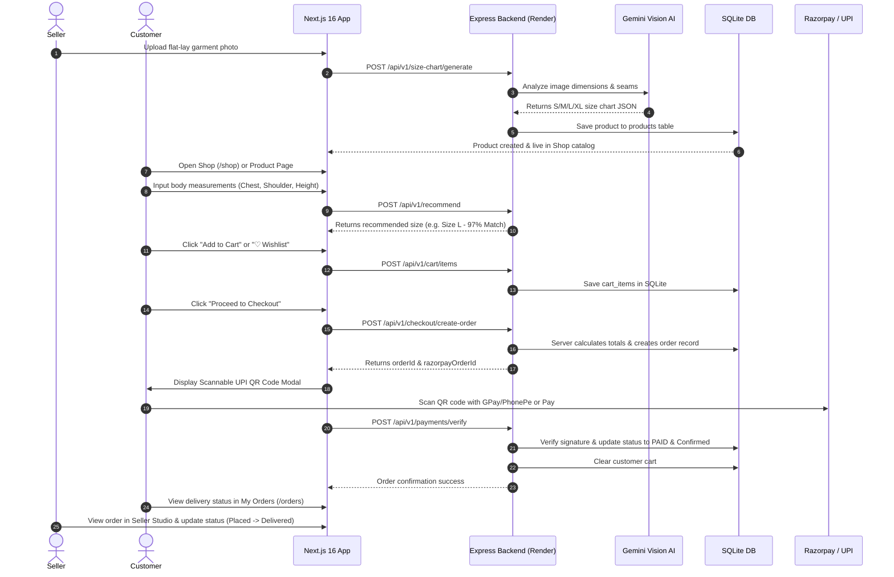
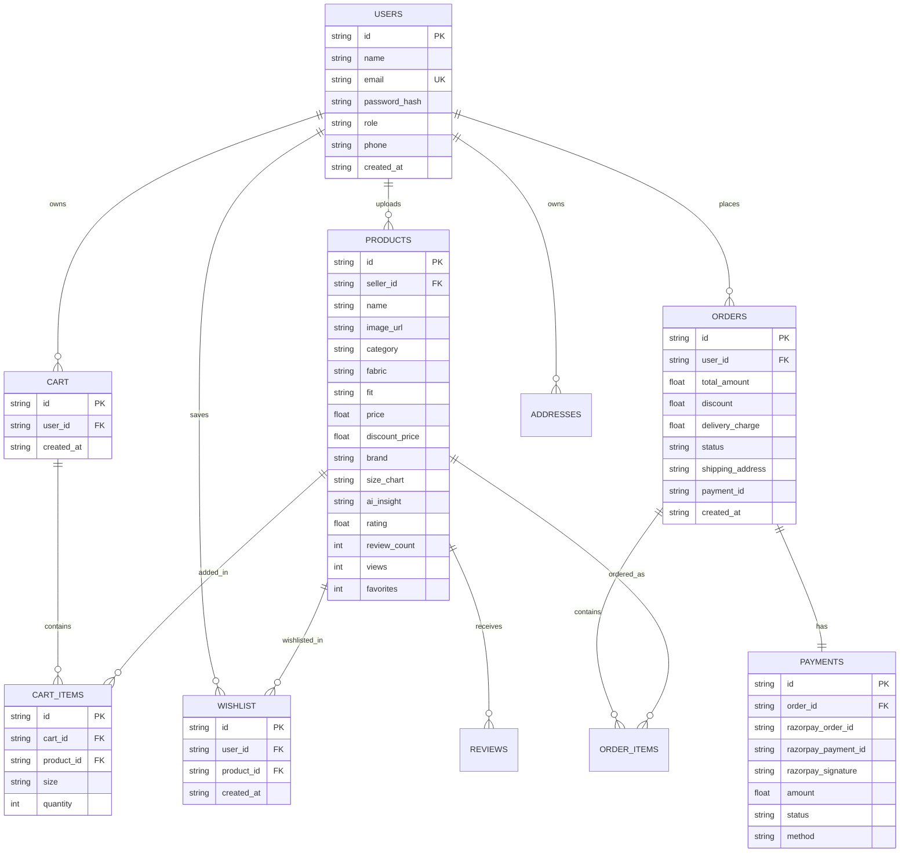

# 🛍️ FitGenius AI — AI-Powered Fashion Shopping Platform

[](https://render.com/deploy?repo=https://github.com/Shanmukhavijay999/FitGenius-AI-dynamic)
[](https://nextjs.org/)
[](https://expressjs.com/)
[](https://www.sqlite.org/)
[](https://ai.google.dev/)
[](https://razorpay.com/)

---

## 🌐 Live URLs & Deployment Links

- **GitHub Repository**: [https://github.com/Shanmukhavijay999/FitGenius-AI-dynamic.git](https://github.com/Shanmukhavijay999/FitGenius-AI-dynamic.git)
- **Render Live Backend**: [https://fitgenius-ai-backend.onrender.com](https://fitgenius-ai-backend.onrender.com)
- **Vercel Live Frontend**: [https://fitgenius-ai-dynamic.vercel.app](https://fitgenius-ai-dynamic.vercel.app)

---

## 🚀 How to Deploy on Render (Step-by-Step)

### Option 1: Automatic 1-Click Render Deployment (Recommended)
Click the button below to automatically import `render.yaml` Blueprint into your Render account:

[](https://render.com/deploy?repo=https://github.com/Shanmukhavijay999/FitGenius-AI-dynamic)

### Option 2: Manual Render Dashboard Setup
1. Go to [Render Dashboard](https://dashboard.render.com/) and click **New +** → **Web Service**.
2. Connect your GitHub repository: `https://github.com/Shanmukhavijay999/FitGenius-AI-dynamic.git`.
3. Configure the Web Service fields:
   - **Name**: `fitgenius-ai-backend`
   - **Root Directory**: `backend`
   - **Environment**: `Node`
   - **Build Command**: `npm install`
   - **Start Command**: `node server.js`
4. Add Environment Variables under **Advanced**:
   - `PORT` = `10000`
   - `NODE_ENV` = `production`
   - `GEMINI_API_KEY` = *your_gemini_api_key*
   - `JWT_SECRET_KEY` = `super_secret_key_fitgenius_2026`
   - `RAZORPAY_KEY_ID` = `rzp_test_fitgenius_demo`
   - `RAZORPAY_KEY_SECRET` = `fitgenius_demo_secret_key`
5. Click **Create Web Service**. Render will build and deploy your backend live!

---

## 📖 System Architecture Diagram

```mermaid
graph TD
    subgraph Client ["Frontend (Next.js 16 + React 19 + Framer Motion)"]
        UI[User Interface & Dark Theme]
        Navbar[Navbar + Role Switcher]
        ShopPage[Shop Catalogue /shop]
        ProdDetail[Product Details /products/id]
        SizeRec[AI Size Finder /recommend]
        WishlistPage[Wishlist /wishlist]
        CartPage[Cart /cart]
        CheckoutPage[Checkout & Razorpay Modal /checkout]
        OrdersPage[My Orders Timeline /orders]
        SellerDash[Seller Dashboard /seller/products]
        AIChat[Floating Ask AI Chatbot]
    end

    subgraph Server ["Backend (Node.js Express API - Port 8001 / Render 10000)"]
        AuthMiddleware[JWT Auth Middleware]
        ProductsRouter[/api/v1/products]
        ShopRouter[/api/v1/shop]
        WishlistRouter[/api/v1/wishlist]
        CartRouter[/api/v1/cart]
        CheckoutRouter[/api/v1/checkout]
        PaymentsRouter[/api/v1/payments]
        OrdersRouter[/api/v1/orders]
        ChatRouter[/api/v1/chat]
        SizeChartRouter[/api/v1/size-chart]
        RecommendRouter[/api/v1/recommend]
        SellerStatsRouter[/api/v1/seller/dashboard]
    end

    subgraph External ["AI & Payment Services"]
        Gemini[Google Gemini Vision API]
        Razorpay[Razorpay Payment SDK & Scannable UPI QR]
    end

    subgraph Database ["SQLite Persistent Database"]
        DB[(fitgenius.db)]
    end

    UI --> Server
    AIChat --> ChatRouter
    ChatRouter --> DB
    ChatRouter --> Gemini
    SizeChartRouter --> Gemini
    CheckoutPage --> CheckoutRouter
    CheckoutRouter --> Razorpay
    PaymentsRouter --> DB
    ProductsRouter --> DB
    ShopRouter --> DB
    WishlistRouter --> DB
    CartRouter --> DB
    OrdersRouter --> DB
```

---

## 🔄 E-Commerce Workflow Diagram



---

## 🗄️ Database Entity-Relationship (ER) Schema Diagram



---

## 🔌 API Endpoint Reference

| Method | Endpoint | Description |
|--------|----------|-------------|
| `GET` | `/api/v1/shop` | Public catalog with filters, search, sorting & pagination |
| `GET` | `/api/v1/products` | Get all products |
| `GET` | `/api/v1/products/:id` | Get product details & increment view count |
| `POST` | `/api/v1/products` | Create product with image upload |
| `PUT` | `/api/v1/products/:id` | Update product details |
| `DELETE` | `/api/v1/products/:id` | Permanently delete product |
| `POST` | `/api/v1/size-chart/generate` | AI Gemini size chart extraction |
| `POST` | `/api/v1/recommend` | Calculate customer size recommendation |
| `GET` | `/api/v1/wishlist` | Get saved wishlist items |
| `POST` | `/api/v1/wishlist` | Add product to wishlist |
| `DELETE` | `/api/v1/wishlist/:id` | Remove product from wishlist |
| `GET` | `/api/v1/cart` | Get cart with calculated totals |
| `POST` | `/api/v1/cart/items` | Add item to cart |
| `PUT` | `/api/v1/cart/items/:id` | Update item quantity |
| `DELETE` | `/api/v1/cart/items/:id` | Remove item from cart |
| `POST` | `/api/v1/checkout/create-order` | Server-validated checkout & Razorpay order creation |
| `POST` | `/api/v1/payments/verify` | Verify Razorpay payment signature & confirm order |
| `GET` | `/api/v1/orders` | Customer order history & tracking timeline |
| `GET` | `/api/v1/orders/seller/all` | Seller order fulfilment list |
| `PUT` | `/api/v1/orders/:id/status` | Update delivery status |
| `POST` | `/api/v1/chat` | AI Shopping Assistant DB query chatbot |

---

## ⚙️ Local Setup & Running

```bash
# Clone Repository
git clone https://github.com/Shanmukhavijay999/FitGenius-AI-dynamic.git
cd FitGenius-AI-dynamic

# Start Development Server
npm run dev
```

- **Frontend**: [http://localhost:3000](http://localhost:3000)
- **Backend API**: [http://localhost:8001/api/v1](http://localhost:8001/api/v1)

---

## 📜 License

Distributed under the **MIT License**.
