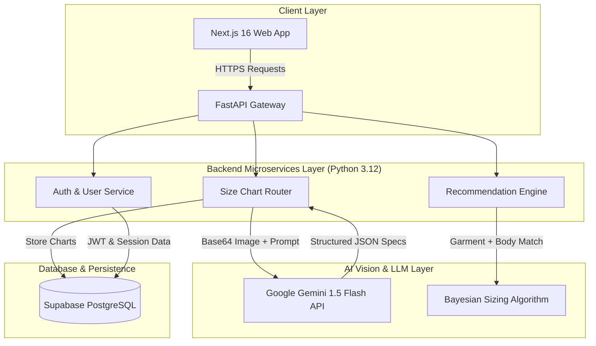
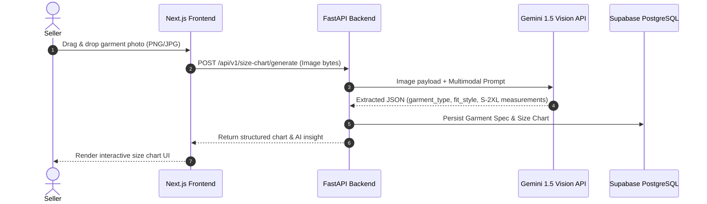
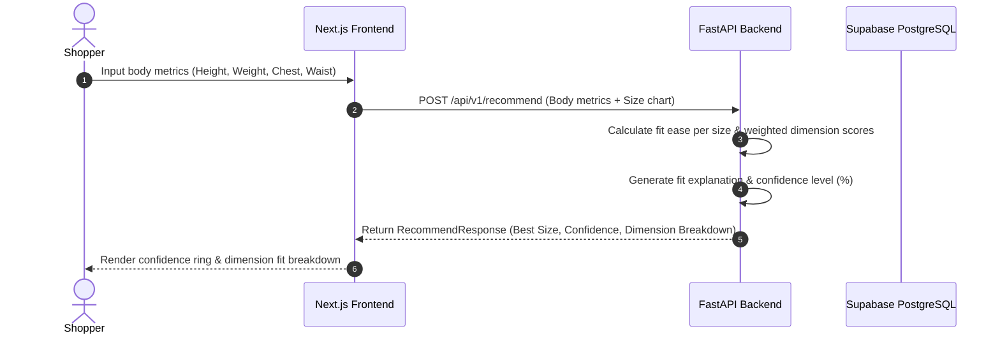

# 👕 FitGenius AI — Dynamic Size & Fit Chart Generator

[](https://nextjs.org/)
[](https://fastapi.tiangolo.com/)
[](https://deepmind.google/technologies/gemini/)
[](https://supabase.com/)
[](LICENSE)

An enterprise-grade, AI-powered SaaS platform designed to automatically extract garment measurements from product photos using **Google Gemini Vision** and calculate high-precision, personalized size recommendations for online shoppers.

---

## 📌 Project Overview & Problem Statement

Sizing inconsistency is the **#1 cause of e-commerce returns** in fashion retail, accounting for over **65% of apparel returns** and causing billions in logisitical friction and carbon emissions.

**FitGenius AI** solves this problem end-to-end:
1. **For Sellers:** Upload flat-lay garment photos -> **Gemini Vision** automatically extracts physical garment dimensions (chest, shoulder, length, waist) and builds structured S/M/L/XL/2XL size charts in < 3 seconds.
2. **For Shoppers:** Enter basic body measurements (Height, Weight, Chest, Waist) -> **Fit Matching Engine** evaluates fit ease tolerances, returns exact size recommendations with a **Confidence %**, detailed fit analysis, and AI explanation.

---

## 📐 System Architecture & Diagrams

### 1. High-Level Architecture



---

### 2. Seller Workflow: Garment Processing & Size Chart Generation



---

### 3. Shopper Workflow: Personalized Fit Recommendation



---

## 🛠️ Tech Stack

| Domain | Technology | Purpose |
| :--- | :--- | :--- |
| **Frontend** | **Next.js 16 (App Router)** | Modern SSR/CSR hybrid application |
| **Styling & UI** | **Tailwind CSS v4 + Framer Motion** | Glassmorphism, tilt effects, fluid animations |
| **Icons & Design** | **Lucide React + Base UI** | Enterprise UI components |
| **Backend API** | **FastAPI (Python 3.12)** | High-performance async REST API framework |
| **AI Vision & LLM** | **Google Gemini 1.5 Flash** | Multimodal garment measurement extraction |
| **Database** | **PostgreSQL (Supabase)** | Relational storage for products, charts & users |
| **ORM & Migrations** | **SQLAlchemy + Alembic** | Schema management and migrations |
| **Authentication** | **PyJWT + Passlib (Bcrypt)** | JWT token auth & password hashing |

---

## ⚡ API Endpoints Quick Reference

| Method | Endpoint | Description |
| :--- | :--- | :--- |
| `GET` | `/health` | Service health status |
| `POST` | `/api/v1/size-chart/generate` | Generates size chart from uploaded garment photo |
| `POST` | `/api/v1/recommend` | Recommends size based on body measurements & size chart |
| `POST` | `/api/v1/auth/register` | Registers a new seller/user account |
| `POST` | `/api/v1/auth/login` | Authenticates user and returns JWT bearer token |
| `GET` | `/api/v1/auth/me` | Retrieves current authenticated user profile |

---

## 🚀 Quick Start Guide

### Prerequisites
- Node.js `v18+` or `v20+`
- Python `3.10+` or `3.12+`
- Google Gemini API Key (`GEMINI_API_KEY`)

### 1. Backend Setup
```bash
cd backend

# Create virtual environment
python -m venv .venv
# Activate virtual environment (Windows)
.venv\Scripts\activate

# Install dependencies
pip install -r requirements.txt

# Environment variables
cp .env.example .env
# Edit .env and insert your GEMINI_API_KEY

# Start FastAPI server
uvicorn app.main:app --reload --port 8000
```

### 2. Frontend Setup
```bash
cd frontend

# Install dependencies
npm install

# Start Next.js development server
npm run dev
```

Open `http://localhost:3000` in your browser to view the application.

---

## 🌐 Repository & Version Control

- **GitHub Repository:** `https://github.com/Shanmukhavijay999/FitGenius-AI-dynamic.git`

To push latest code to your repository:
```bash
git add .
git commit -m "feat: complete end-to-end AI size chart generator with clean TypeScript and FastAPI API"
git remote add origin https://github.com/Shanmukhavijay999/FitGenius-AI-dynamic.git
git push -u origin main
```
